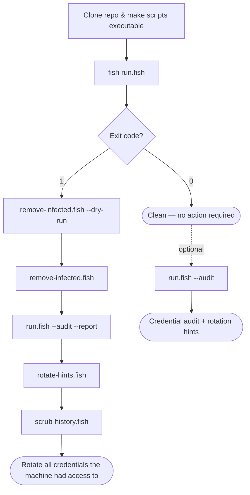

# atomic-arch-response-toolkit

Fish shell scripts to **detect, triage, and recover** from the June 2026 Arch User Repository (AUR) supply-chain attack — the [Atomic Arch](https://www.sonatype.com/blog/atomic-arch-npm-campaign-adds-malicious-dependency) campaign that injected `atomic-lockfile`, `js-digest`, and `lockfile-js` into orphaned AUR packages, deploying the [`deps`](https://ioctl.fail/preliminary-analysis-of-aur-malware/) credential stealer and optional eBPF rootkit.

> **Official Arch repos (`[core]`, `[extra]`, `[multilib]`) were not affected.** This toolkit targets AUR packages only.

## TL;DR

Use AUR during **Jun 9–14, 2026**? Clone, scan, act on the exit code:

```fish
git clone https://github.com/bolens/atomic-arch-response-toolkit.git && cd atomic-arch-response-toolkit && chmod +x run.fish run.sh install.fish scripts/*.fish && fish run.fish
```

- **Exit `0`** — nothing flagged; you're done (or run `fish run.fish --audit` if you want a credential check anyway).
- **Exit `1`** — compromise indicators; follow the [recovery flow](#decision-flow) below.
- **Exit `2`** — warnings only (hardening hygiene, or benign unknown AUR packages in window)
- **Exit `3`** — insufficient data (unreadable `pacman.log`); re-run with appropriate permissions.
- **Exit `4`** — invalid CLI arguments.

For guided recovery after a compromise: `fish run.fish --recover`

Offline or air-gapped: append `--local` to use the bundled package list.

### Decision flow



---

## Quick start

```fish
git clone https://github.com/bolens/atomic-arch-response-toolkit.git
cd atomic-arch-response-toolkit
chmod +x run.fish run.sh install.fish lint.fish scripts/*.fish

# Optional: install symlinks to ~/.local/bin
fish install.fish

# Full scan (fetches latest infected-package lists from the web)
fish run.fish

# Offline scan (uses bundled data/infected-pkgs.txt)
fish run.fish --local

# Bash login shell? Use the wrapper:
./run.sh --local
```

**Exit codes:** `0` clean · `1` compromise · `2` warnings · `3` insufficient data · `4` invalid args. See [Automation](#automation).

---

## Requirements

| Required | Optional |
|----------|----------|
| [Fish shell](https://fishshell.com/) | `paru` or `yay` (AUR helper cache scanning) |
| Arch Linux (or derivative) | `rg` (ripgrep — faster grep; falls back to grep) |
| `pacman`, `curl`, `find`, `comm` | |

---

## How the full scan works

`run.fish` runs seven steps in order. Steps 6–7 run automatically when earlier steps find issues, or when you pass `--audit`.

| Step | Script | What it checks |
|:----:|--------|----------------|
| 1 | `check-infected-pkgs.fish` | Installed packages vs known infected list; HIGH/LOW risk by install date |
| 2 | `scan-aur-window.fish` | Foreign AUR activity during **Jun 9–14, 2026**; tiered triage (critical → exit `1`, benign unknown → exit `2`) |
| 3 | `scan-pacman-timeline.fish` | Known infected packages in `pacman.log` during the window |
| 4 | `scan-malware-artifacts.fish` | `deps` ELF, malicious npm packages, AUR cache hooks, eBPF maps, runtime IOCs, extra persistence |
| 5 | `scan-hardening.fish` | `npm ignore-scripts`, bun env vars, paru/yay review settings, correlated `--noconfirm` in history |
| 6 | `audit-stolen-credentials.fish` | SSH, git, docker, browsers, chat apps, env files, shell history |
| 7 | `rotate-hints.fish` | Concrete logout and rotation commands |

Infected-package lists are merged from two sources when fetched online:

- [Arch markdown list](https://md.archlinux.org/s/SxbqukK6IA)
- [cscs paste](https://cscs.pastes.sh/raw/aurvulntest20260611.sh)

The merged list is cached in `data/infected-pkgs.txt`. Online fetches log SHA256 checksums per source. `--local` warns if the bundled list is older than 7 days (configurable).

### Configuration

Copy `config.fish.example` to `~/.config/atomic-arch-response/config.fish` to override:

- `AUR_DEV_ROOT` — directory scanned for `.env` / `stack.env` files (default: `~/dev`)
- `AUR_DEPS_SEARCH_PATHS` — extra paths for `deps` ELF search
- `AUR_LIST_MAX_AGE_DAYS` — staleness warning threshold for `--local`
- `AUR_LIST_URL_EXTRA` — optional third infected-package list URL (merged at fetch time)

---

## Usage

### Recommended commands

```fish
# Standard scan — fetch fresh lists, print results
fish run.fish

# Offline / air-gapped — bundled list only
fish run.fish --local

# Always run credential audit + rotation hints, even if clean
fish run.fish --audit

# Save a timestamped report under reports/ plus JSON summary
fish run.fish --report --json

# Quiet mode for timers/CI — minimal stdout, still writes report/json
fish run.fish --local --quiet --report --json --fail-on compromise --quick

# Interactive recovery wizard (remove → verify → rotate → scrub all shells)
fish run.fish --recover --report
```

### All `run.fish` flags

| Flag | Effect |
|------|--------|
| `--local` | Skip network fetch; use `data/infected-pkgs.txt` |
| `--audit` | Always run steps 6–7 (credential audit + rotation hints) |
| `--report` | Write unified log to `reports/full-scan-*.log` |
| `--json` | Print JSON summary to stdout at end (`reports/latest-summary.json`) |
| `--quiet` | Suppress scan output (report/json still written when requested) |
| `--quick` | Faster artifact scan (narrower search paths) |
| `--recover` | Interactive recovery wizard when compromise found |
| `--if-compromised` | Credential audit only fails when compromise detected (used automatically) |
| `--fail-on MODE` | Exit policy: `all` (default), `compromise`, `none` |
| `--prune-days N` | Delete report files older than N days after the scan |
| `--skip-pkg-check` | Skip step 1 (useful if you already removed packages) |
| `--version` | Print toolkit version |
| `-h`, `--help` | Show usage |

Individual scripts accept `--local`, `--report`, `--quiet`, and `--help` where relevant:

```fish
fish scripts/check-infected-pkgs.fish --local
fish scripts/scan-malware-artifacts.fish
fish scripts/audit-stolen-credentials.fish --help
```

---

## If something is found

Follow this order. Do not skip credential rotation if an infected package was installed during the compromise window.

```fish
# 1. Preview what would be removed
fish scripts/remove-infected.fish --dry-run

# 2. Remove infected packages (interactive confirmation)
fish scripts/remove-infected.fish

# 3. Verify removal
fish scripts/remove-infected.fish --verify

# 4. Re-scan with full audit and save a report
fish run.fish --audit --report

# 5. Apply hardening recommendations (optional)
fish scripts/apply-hardening.fish
fish scripts/apply-hardening.fish --apply

# 6. Rotate credentials — follow printed hints
fish scripts/rotate-hints.fish

# 6. After rotating secrets, redact them from shell history (all shells)
fish scripts/scrub-history.fish --dry-run
fish scripts/scrub-history.fish --all-shells
```

`remove-infected.fish` flags:

| Flag | Effect |
|------|--------|
| `--dry-run` | Show packages and `pacman -Rns` command without running |
| `--force` | Skip confirmation prompt |
| `--verify` | Exit non-zero if any infected packages remain installed |
| `pkg ...` | Remove specific packages instead of auto-detecting from the list |

---

## What the malware steals

The `deps` infostealer targets developer credentials: SSH keys, browser cookies, GitHub/npm tokens, Docker registry auth, Discord/Slack/Teams sessions, Vault tokens, shell histories, `.env` files, and more. See the [ioctl.fail analysis](https://ioctl.fail/preliminary-analysis-of-aur-malware/) for full IOCs.

**If any infected package was installed during Jun 9–14, 2026, assume those credentials are compromised and rotate them.**

---

## Automation

### Exit codes

| Code | Meaning |
|:----:|---------|
| `0` | No issues detected |
| `1` | Compromise indicators (infected packages, timeline hits, artifacts, critical unknown window packages) |
| `2` | Warnings only (hardening hygiene, benign unknown AUR packages in window) |
| `3` | Insufficient data (unreadable pacman logs) |
| `4` | Invalid CLI arguments |

Use `--fail-on compromise` for timers so hardening warnings do not alert:

```fish
fish run.fish --local --json --fail-on compromise || notify-send "AUR incident: issues found"
```

`reports/latest-summary.json` includes structured `findings` arrays (package names, artifact paths, timeline lines) plus `severity` and toolkit `version`.

### Weekly systemd timer (optional)

```fish
mkdir -p ~/.config/systemd/user
ln -sf ~/atomic-arch-response-toolkit/systemd/atomic-arch-scan.service ~/.config/systemd/user/
ln -sf ~/atomic-arch-response-toolkit/systemd/atomic-arch-scan.timer ~/.config/systemd/user/
systemctl --user daemon-reload
systemctl --user enable --now atomic-arch-scan.timer
```

The service uses `--fail-on compromise --quick` and respects `AUR_RESPONSE_DIR` in the unit file. Adjust the clone path in the symlinks if needed.

---

## Development

```fish
# Lint all Fish scripts
fish lint.fish

# Run full test suite
fish tests/run-all.fish
```

### Project layout

```
atomic-arch-response-toolkit/
├── run.fish                      # Main entry point (orchestrator)
├── run.sh                        # Bash wrapper → run.fish
├── install.fish                  # Install portable wrappers + atomic-* symlinks
├── bin/atomic-run.fish           # Portable entry point (resolves clone path)
├── VERSION                       # Toolkit version (1.2.0)
├── config.fish.example           # Optional user config template
├── lint.fish                     # fishcheck linter for all scripts
├── lib/
│   ├── common.fish               # Shared helpers (paths, pacman, lists)
│   ├── findings.fish             # Tab-delimited findings store
│   ├── history.fish              # Shell history helpers
│   ├── ioc.fish                  # Malware IOC and persistence detection
│   └── reports.fish              # JSON summary and report retention
├── scripts/                      # Scan and recovery scripts
│   ├── check-infected-pkgs.fish
│   ├── scan-aur-window.fish
│   ├── scan-pacman-timeline.fish
│   ├── scan-malware-artifacts.fish
│   ├── scan-hardening.fish
│   ├── apply-hardening.fish
│   ├── audit-stolen-credentials.fish
│   ├── rotate-hints.fish
│   ├── remove-infected.fish
│   └── scrub-history.fish
├── data/infected-pkgs.txt        # Cached merged package list
├── reports/                      # Generated logs (gitignored)
├── tests/
│   ├── run-all.fish              # Full test suite
│   ├── smoke.fish                # Alias for run-all.fish
│   ├── lib/test-utils.fish
│   ├── unit/                     # Pure function tests
│   ├── integration/              # End-to-end script tests
│   └── fixtures/
├── .github/workflows/ci.yml      # CI: tests + fishcheck lint
└── systemd/
    ├── atomic-arch-scan.service  # Weekly user timer unit
    ├── atomic-arch-scan.timer
    └── atomic-arch-notify@.service  # Example notify-on-scan unit
```

---

## References

### Official & community response

- [Arch Linux — Active AUR malicious packages incident](https://archlinux.org/news/active-aur-malicious-packages-incident/)
- [aur-general — staff HedgeDoc affected-package list](https://lists.archlinux.org/archives/list/aur-general@lists.archlinux.org/message/FCH7TT6IOVT7D477JKSVJALBKADAARSW/)
- [aur-general — first confirmed report (gnome-randr-rust)](https://lists.archlinux.org/archives/list/aur-general@lists.archlinux.org/thread/L2JXQNYBGWOQQQXDEPEAICBHKFEFANUC/)

### Technical analysis

- [ioctl.fail — preliminary analysis of AUR malware](https://ioctl.fail/preliminary-analysis-of-aur-malware/)
- [Sonatype — Atomic Arch npm campaign](https://www.sonatype.com/blog/atomic-arch-npm-campaign-adds-malicious-dependency)
- [SafeDep — Atomic Arch campaign intel](https://safedep.io/ti/campaigns/atomic-arch)

### Package lists & detection tools

- [Arch HedgeDoc — merged affected-package list](https://md.archlinux.org/s/SxbqukK6IA)
- [cscs — detection script / package list](https://cscs.pastes.sh/raw/aurvulntest20260611.sh)
- [lenucksi/aur-malware-check](https://github.com/lenucksi/aur-malware-check)

### Coverage

- [IFIN — community triage thread](https://discourse.ifin.network/t/400-aur-packages-compromised-with-infostealer-and-rootkit/577)
- [BleepingComputer — 400+ packages compromised](https://www.bleepingcomputer.com/news/security/over-400-arch-linux-packages-compromised-to-push-rootkit-infostealer/)
- [Phoronix — 1,500+ packages affected](https://www.phoronix.com/news/Arch-Linux-AUR-More-Than-1500)

## License

[MIT](LICENSE)
