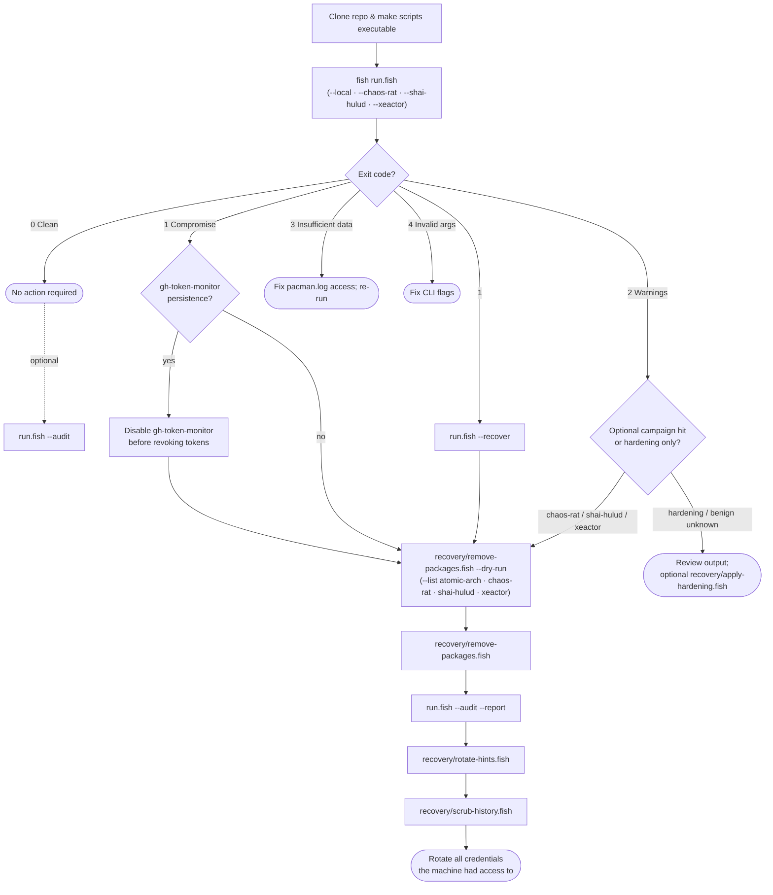

# aur-response-toolkit

[](https://github.com/bolens/aur-response-toolkit/actions/workflows/ci.yml)
[](LICENSE)

Fish shell toolkit to **detect, triage, and recover** from Arch User Repository (AUR) supply-chain incidents. **[Atomic Arch](https://www.sonatype.com/blog/atomic-arch-npm-campaign-adds-malicious-dependency)** (June 2026 — `atomic-lockfile` / `js-digest` npm hooks, [`deps`](https://ioctl.fail/preliminary-analysis-of-aur-malware/) infostealer) is the default primary scan; opt-in campaigns cover **Chaos RAT**, **Mini Shai-Hulud**, and **xeactor** (2018).

> **Official Arch repos (`[core]`, `[extra]`, `[multilib]`) were not affected.** This toolkit targets AUR packages only.

## TL;DR

Use AUR during **Jun 9–14, 2026**? Clone, scan, act on the exit code:

```fish
git clone https://github.com/bolens/aur-response-toolkit.git && cd aur-response-toolkit && chmod +x run.fish run.sh install.fish lint.fish scripts/*/*.fish && fish run.fish
```

- **Exit `0`** — nothing flagged; you're done (or run `fish run.fish --audit` if you want a credential check anyway).
- **Exit `1`** — compromise indicators; follow the [recovery flow](#decision-flow) below.
- **Exit `2`** — warnings only (hardening hygiene, or benign unknown AUR packages in window)
- **Exit `3`** — insufficient data (unreadable `pacman.log`); re-run with appropriate permissions.
- **Exit `4`** — invalid CLI arguments.

For guided recovery after a compromise: `fish run.fish --recover`

Offline or air-gapped: append `--local` to use the bundled package list.

### Decision flow



---

## Quick start

```fish
git clone https://github.com/bolens/aur-response-toolkit.git
cd aur-response-toolkit
chmod +x run.fish run.sh install.fish lint.fish scripts/*/*.fish

# Optional: install symlinks to ~/.local/bin
fish install.fish

# System-wide FHS install (/usr/share + /usr/bin; needs root)
sudo fish install.fish --system
# Or: sudo fish install.fish --prefix /usr/local
# Packagers: fish install.fish --prefix /usr --destdir /tmp/stage

# AUR (Arch): paru -S aur-response-toolkit

# Full scan (fetches latest infected-package lists from the web)
fish run.fish

# Offline scan (uses bundled data/lists/atomic-arch-pkgs.txt)
fish run.fish --local

# Bash login shell? Use the wrapper:
./run.sh --local
```

**Exit codes:** `0` clean · `1` compromise · `2` warnings · `3` insufficient data · `4` invalid args. See [Automation](#automation).

---

## Requirements

Arch Linux (or a pacman-based derivative). `pacman` itself ships with the base system — there is no separate package to install for it.

Commands like `realpath`, `sha256sum`, and `zstdcat` are **binaries inside other packages**, not standalone package names. Search for the **pacman package** in the table below, not the command name.

| Role | Command(s) | Pacman package | Fallback (no extra package) |
|------|------------|----------------|-----------------------------|
| **Required** | [Fish](https://fishshell.com/) | `fish` | — |
| | `curl` | `curl` | — |
| | `find` | `findutils` | — |
| | `comm`, `date`, `sha256sum`, `realpath` | `coreutils` | `readlink -f` (`aur_realpath`); `openssl dgst` (`aur_sha256`; package `openssl`) |
| | `grep` (used when `rg` is absent) | `grep` | — |
| **Optional (preferred)** | `fd` | `fd` | GNU `find` (`aur_find`) |
| | `rg` | `ripgrep` | `grep` (`aur_grep`) |
| | `curlie` | `curlie` | `curl` (`aur_curl`; `file://` always uses `curl`) |
| | `zstdcat` | `zstd` | `zstd -dc` (`aur_zstdcat`; `.zst` rotated pacman logs) |
| | `jq` | `jq` | hand-built JSON summary / `aur_docker_config_registry_keys` |
| | `pgrep` | `procps-ng` | `ps` + `aur_grep` (runtime process IOCs) |
| | `ss` | `iproute2` | `netstat` (`net-tools`) → `lsof` |
| **Optional (AUR / node)** | AUR helper cache scan | `paru`, `yay`, `pikaur`, `trizen`, or `aura` (AUR); `libpamac` (Manjaro GUI) | `makepkg` (in `pacman`; build-dir scan only) |
| | npm cache scan | `npm` | — |
| | bun cache scan | `bun` | — |

### Install commands

Copy one block. `--needed` skips packages you already have.

**Required only** (minimum to run scans):

```fish
sudo pacman -S --needed fish curl findutils coreutils grep
```

**Optional preferred tools** (faster search, richer JSON, `.zst` pacman logs, runtime IOCs — add only what you want):

```fish
sudo pacman -S --needed fd ripgrep curlie zstd jq procps-ng iproute2
```

**Everything** (required + all optional pacman-repo tools + npm + bun):

```fish
sudo pacman -S --needed fish curl findutils coreutils grep fd ripgrep curlie zstd jq procps-ng iproute2 npm bun
```

**AUR-only extras** (install with your AUR helper after the pacman lines above; pick one helper, not all):

```fish
paru -S --needed paru      # or: yay -S --needed yay
```

All shims live in `lib/common.fish`, `lib/ioc.fish`, and `lib/reports.fish`. Scripts and tests call `aur_*` helpers — not raw `grep`, `find`, `curl`, `sha256sum`, `pgrep`, or `ss` — so fish aliases and optional faster tools work without branching at call sites.

### Supported distributions

Any **pacman-based** system with AUR access is in scope — the campaign targets AUR packages, not official `[core]`/`[extra]` repos:

| Distro family | Examples | Notes |
|---------------|----------|-------|
| Arch Linux | Arch, CachyOS, EndeavourOS, Garuda, ArcoLinux | Full support |
| Independent pacman forks | Manjaro, Artix, Parabola | Install-date checks use `%INSTALLDATE%` from the pacman local db (locale-safe). Pamac build caches under `/var/tmp/pamac-build-*` are scanned automatically. |
| Not supported | Debian, Fedora, NixOS (without an Arch/pacman stratum) | No `pacman` / AUR workflow |

**Manjaro / pamac-only users:** PKGBUILD hook scans cover pamac build dirs (including custom `BuildDirectory` from pamac.conf). GUI-only installs skip shell-history checks but package/log/timeline scans still apply. Ensure `pacman.log` is readable (`sudo fish run.fish` if you hit exit `3`). Override paths in `~/.config/aur-response/config.fish` for chroots or custom pamac build dirs.

---

## How the full scan works

`run.fish` runs seven steps in order. Steps 6–7 run automatically when earlier steps find issues, or when you pass `--audit`.

| Step | Script | What it checks |
|:----:|--------|----------------|
| 1 | `check/atomic-arch-pkgs.fish` | Atomic Arch list; HIGH/LOW by install date |
| 1b | `check/chaos-rat-pkgs.fish` | Optional: Chaos RAT packages; HIGH/LOW by **Jul 16–18, 2025** install date |
| 1c | `check/shai-hulud-pkgs.fish` | Optional: Mini Shai-Hulud packages; HIGH/LOW by **May 16–17, 2026** install date |
| 1d | `check/xeactor-pkgs.fish` | Optional: xeactor packages; HIGH/LOW by **Jun 7–Jul 10, 2018** install date |
| 2 | `scan/aur-window.fish` | Foreign AUR activity during **Jun 9–14, 2026**; tiered triage (critical → exit `1`, benign unknown → exit `2`) |
| 3 | `scan/atomic-arch-timeline.fish` | Known infected packages in `pacman.log` during the Atomic Arch window |
| 3b | `scan/chaos-rat-timeline.fish` | Optional: Chaos RAT packages in `pacman.log` during **Jul 16–18, 2025** |
| 3c | `scan/shai-hulud-timeline.fish` | Optional: Shai-Hulud packages in `pacman.log` during **May 16–17, 2026** |
| 3d | `scan/xeactor-timeline.fish` | Optional: xeactor packages in `pacman.log` during **Jun 7–Jul 10, 2018** |
| 4 | `scan/malware-artifacts.fish` | Campaign ELF (multi-SHA256), malicious npm/bun caches, AUR cache hooks, eBPF maps, runtime IOCs, extra persistence |
| 4b | `scan/similar-heuristics.fish` | Installed foreign packages **not** on the Atomic Arch list — campaign-like hooks/obfuscation heuristics |
| 5 | `scan/hardening.fish` | `npm ignore-scripts`, bun env vars, AUR helper review settings (paru/yay/pamac/trizen/aura/aurman), correlated auto-install flags in history |
| 6 | `audit/stolen-credentials.fish` | SSH, git, docker, browsers, chat apps, env files, shell history |
| 7 | `recovery/rotate-hints.fish` | Concrete logout and rotation commands |

Atomic Arch package lists are merged online from upstream sources and cached in `data/lists/atomic-arch-pkgs.txt`. See **[`data/docs/atomic-arch.md`](data/docs/atomic-arch.md)** for URLs, IOC references, and license notes. Index of all campaigns: [`data/docs/sources.md`](data/docs/sources.md).

### Configuration

Copy `config.fish.example` to `~/.config/aur-response/config.fish` to override:

- `AUR_DEV_ROOT` — directory scanned for `.env` / `stack.env` files (default: `~/dev`)
- `AUR_DEPS_SEARCH_PATHS` — extra paths for `deps` ELF search
- `AUR_PACMAN_LOG_DIR` — pacman log directory (default: `/var/log`; use in chroots/containers)
- `AUR_PACMAN_LOCAL_DIR` — pacman local db path (default: `/var/lib/pacman/local`)
- `AUR_HELPER_CACHE_ROOTS` — AUR helper build-cache roots (replaces defaults when set)
- `AUR_MAKEPKG_BUILD_DIRS` — makepkg/ABS dirs scanned for PKGBUILD hooks (default: `~/abs`, `~/builds`, `~/aur`)
- `AUR_PAMAC_BUILD_GLOBS` — pamac build-dir globs (default: parse `BuildDirectory` from pamac.conf + `/var/tmp/pamac-build-*`)
- `AUR_HISTORY_HELPERS` — regex of AUR CLI helper names for shell-history hardening checks
- `AUR_ATOMIC_ARCH_LIST_FILE` — bundled Atomic Arch list (default: `data/lists/atomic-arch-pkgs.txt`)
- `AUR_LIST_MAX_AGE_DAYS` — staleness warning threshold for `--local`
- `AUR_LIST_URL_EXTRA` — optional third Atomic Arch list URL (merged at fetch time)
- `AUR_ENABLE_CHAOS_RAT` — set to `1` to include the Chaos RAT scan in `run.fish` (default off)
- `AUR_ENABLE_SHAI_HULUD` — set to `1` to include the Mini Shai-Hulud scan in `run.fish` (default off)
- `AUR_ENABLE_XEACTOR` — set to `1` to include the xeactor scan in `run.fish` (default off)
- `AUR_CHAOS_RAT_URL_ARCH` — official Arch aur-general security advisory (HTML, parsed on fetch)
- `AUR_CHAOS_RAT_URL_COMMUNITY` — extended community list (plain text)
- `AUR_CHAOS_RAT_URL_EXTRA` — optional third Chaos RAT list URL
- `AUR_CHAOS_RAT_LIST_FILE` — local cache path for the merged list (default: `data/lists/chaos-rat-pkgs.txt`)
- `AUR_SHAI_HULUD_LIST_FILE` — bundled Shai-Hulud list path (default: `data/lists/shai-hulud-pkgs.txt`)
- `AUR_SHAI_HULUD_URL` — optional remote list URL when a consolidated upstream list exists (default: bundled only)
- `AUR_SHAI_HULUD_WINDOW_*` — override May 16–17, 2026 attack window (log regex, install-day regex, label)
- `AUR_XEACTOR_LIST_FILE` — bundled xeactor list path (default: `data/lists/xeactor-pkgs.txt`)
- `AUR_XEACTOR_URL` — optional remote list URL (default: bundled only)
- `AUR_XEACTOR_WINDOW_*` — override Jun 7–Jul 10, 2018 attack window (log regex, label)

### Chaos RAT vs Atomic Arch

These are **separate AUR threat campaigns** that share the same user population (AUR + developer machines). Full provenance: [`data/docs/chaos-rat.md`](data/docs/chaos-rat.md).

| | Atomic Arch (this toolkit’s primary focus) | Chaos RAT (opt-in) |
|---|-------------------------------------------|---------------------|
| Campaign | `atomic-lockfile` / `js-digest` npm hooks in orphaned AUR packages | Cracked/patched browser & game packages (`librewolf-fix-bin`, `minecraft-cracked`, …) |
| Date window | Jun 9–14, 2026 install/timeline relevance | **Jul 16–18, 2025** install/timeline relevance |
| Default scan | Always (steps 1–4) | Off unless `--chaos-rat` or `AUR_ENABLE_CHAOS_RAT=1` |
| Exit severity | `1` compromise | `2` warn (unless `--fail-on` suppresses) |
| Recovery | Full playbook: remove → audit → rotate credentials | Remove packages only; no automatic credential audit chain |
| Timeline | `scan/atomic-arch-timeline.fish` (step 3) | `scan/chaos-rat-timeline.fish` (step 3b, opt-in) |

```fish
# Opt-in Chaos RAT scan alongside the Atomic Arch checks
fish run.fish --chaos-rat --local

# Standalone Chaos RAT package check
fish scripts/check/chaos-rat-pkgs.fish --chaos-rat --local

# Remove Chaos RAT packages (separate list)
fish scripts/recovery/remove-packages.fish --list chaos-rat --dry-run
```

References and upstream list URLs: [`data/docs/chaos-rat.md`](data/docs/chaos-rat.md).

### Mini Shai-Hulud vs Atomic Arch

| | Atomic Arch | Mini Shai-Hulud (opt-in) |
|---|-------------|--------------------------|
| Campaign | `atomic-lockfile` / `js-digest` npm hooks | `crypto-javascript` npm hook in adopted wallet/VPN packages |
| Date window | Jun 9–14, 2026 | **May 16–17, 2026** |
| Default scan | Always (steps 1–4) | Off unless `--shai-hulud` or `AUR_ENABLE_SHAI_HULUD=1` |
| Exit severity | `1` compromise | `2` warn (unless `--fail-on` suppresses) |
| Recovery | Full playbook | Remove packages; **stop `gh-token-monitor` before rotating GitHub tokens** |
| Timeline | step 3 | `scan/shai-hulud-timeline.fish` (step 3c, opt-in) |

```fish
# Opt-in Shai-Hulud scan alongside Atomic Arch checks
fish run.fish --shai-hulud --local

fish scripts/check/shai-hulud-pkgs.fish --shai-hulud --local
fish scripts/recovery/remove-packages.fish --list shai-hulud --dry-run
```

References: [`data/docs/shai-hulud.md`](data/docs/shai-hulud.md).

### xeactor vs Atomic Arch

| | Atomic Arch | xeactor (opt-in) |
|---|-------------|------------------------|
| Campaign | `atomic-lockfile` / `js-digest` npm hooks | Orphaned-package takeover; `ptpb.pw` exfil scripts in PKGBUILD |
| Date window | Jun 9–14, 2026 | **Jun 7–Jul 10, 2018** |
| Default scan | Always (steps 1–4) | Off unless `--xeactor` or `AUR_ENABLE_XEACTOR=1` |
| Exit severity | `1` compromise | `2` warn (unless `--fail-on` suppresses) |
| Recovery | Full playbook | Remove packages only; separate 2018 incident |
| Timeline | step 3 | `scan/xeactor-timeline.fish` (step 3d, opt-in) |

```fish
# Opt-in xeactor scan alongside Atomic Arch checks
fish run.fish --xeactor --local

fish scripts/check/xeactor-pkgs.fish --xeactor --local
fish scripts/recovery/remove-packages.fish --list xeactor --dry-run
```

References: [`data/docs/xeactor.md`](data/docs/xeactor.md).

---

## Usage

### Recommended commands

```fish
# Standard scan — fetch fresh lists, print results
fish run.fish

# Offline / air-gapped — bundled list only
fish run.fish --local

# Always run credential audit + rotation hints, even if clean
fish run.fish --audit

# Save a timestamped report under reports/ plus JSON summary
fish run.fish --report --json

# Quiet mode for timers/CI — minimal stdout, still writes report/json
fish run.fish --local --quiet --report --json --fail-on compromise --quick

# Interactive recovery wizard (remove → verify → rotate → scrub all shells)
fish run.fish --recover --report
```

### All `run.fish` flags

| Flag | Effect |
|------|--------|
| `--local` | Skip network fetch; use `data/lists/atomic-arch-pkgs.txt` |
| `--audit` | Always run steps 6–7 (credential audit + rotation hints) |
| `--report` | Write unified log to `reports/full-scan-*.log` |
| `--json` | Print JSON summary to stdout at end (`reports/latest-summary.json`) |
| `--quiet` | Suppress scan output (report/json still written when requested) |
| `--quick` | Faster artifact scan (narrower search paths) |
| `--all-time` | Ignore Jun 9–14 window for installed-package and timeline checks |
| `--recover` | Interactive recovery wizard when compromise found |
| `--if-compromised` | Credential audit only fails when compromise detected (used automatically) |
| `--fail-on MODE` | Exit policy: `all` (default), `compromise`, `chaos-rat`, `shai-hulud`, `xeactor`, `none` |
| `--chaos-rat` | Also run Chaos RAT package scan (warn-only; separate threat list) |
| `--shai-hulud` | Also run Mini Shai-Hulud package scan (warn-only; separate threat list) |
| `--xeactor` | Also run xeactor package scan (warn-only; separate threat list) |
| `--prune-days N` | Delete report files older than N days after the scan |
| `--skip-pkg-check` | Skip step 1 (useful if you already removed packages) |
| `--version` | Print toolkit version |
| `-h`, `--help` | Show usage |

Individual scripts accept `--local`, `--report`, `--quiet`, and `--help` where relevant:

```fish
fish scripts/check/atomic-arch-pkgs.fish --local
fish scripts/scan/malware-artifacts.fish
fish scripts/scan/similar-heuristics.fish --local
fish scripts/check/list-freshness.fish
fish scripts/audit/stolen-credentials.fish --help
```

---

## If something is found

Follow this order. Do not skip credential rotation if an infected package was installed during the compromise window.

```fish
# 1. Preview what would be removed
fish scripts/recovery/remove-packages.fish --dry-run

# 2. Remove infected packages (interactive confirmation)
fish scripts/recovery/remove-packages.fish

# 3. Verify removal
fish scripts/recovery/remove-packages.fish --verify

# 4. Re-scan with full audit and save a report
fish run.fish --audit --report

# 5. Apply hardening recommendations (optional)
fish scripts/recovery/apply-hardening.fish
fish scripts/recovery/apply-hardening.fish --apply

# 6. Rotate credentials — follow printed hints
fish scripts/recovery/rotate-hints.fish

# 6. After rotating secrets, redact them from shell history (all shells)
fish scripts/recovery/scrub-history.fish --dry-run
fish scripts/recovery/scrub-history.fish --all-shells
```

`recovery/remove-packages.fish` flags:

| Flag | Effect |
|------|--------|
| `--dry-run` | Show packages and `pacman -Rns` command without running |
| `--force` | Skip confirmation prompt |
| `--verify` | Exit non-zero if any matching packages remain installed |
| `--list TYPE` | List to match: `atomic-arch` (default), `chaos-rat`, `shai-hulud`, or `xeactor` |
| `pkg ...` | Remove specific packages instead of auto-detecting from the list |

---

## What the malware steals

The `deps` infostealer targets developer credentials: SSH keys, browser cookies, GitHub/npm tokens, Docker registry auth, Discord/Slack/Teams sessions, Vault tokens, shell histories, `.env` files, and more. See the [ioctl.fail analysis](https://ioctl.fail/preliminary-analysis-of-aur-malware/) for full IOCs.

**If any infected package was installed during Jun 9–14, 2026, assume those credentials are compromised and rotate them.**

---

## Automation

### Exit codes

| Code | Meaning |
|:----:|---------|
| `0` | No issues detected |
| `1` | Compromise indicators (infected packages, timeline hits, artifacts, critical unknown window packages) |
| `2` | Warnings only (hardening hygiene, benign unknown AUR packages in window, optional Chaos RAT / Shai-Hulud / xeactor hits) |
| `3` | Insufficient data (unreadable pacman logs) |
| `4` | Invalid CLI arguments |

Use `--fail-on compromise` for timers so hardening warnings do not alert:

```fish
fish run.fish --local --json --fail-on compromise || notify-send "AUR incident: issues found"
```

`reports/latest-summary.json` includes structured `findings` arrays (package names, artifact paths, timeline lines) plus `severity`, toolkit `version`, and optional-campaign counters (`chaos_rat_*`, `shai_hulud_*`).

### Weekly systemd timer (optional)

```fish
mkdir -p ~/.config/systemd/user
ln -sf ~/aur-response-toolkit/systemd/aur-response-scan.service ~/.config/systemd/user/
ln -sf ~/aur-response-toolkit/systemd/aur-response-scan.timer ~/.config/systemd/user/
systemctl --user daemon-reload
systemctl --user enable --now aur-response-scan.timer
```

The service uses `--fail-on compromise --quick` and respects `AUR_RESPONSE_DIR` in the unit file. Adjust the clone path in the symlinks if needed.

---

## Development

See [CONTRIBUTING.md](CONTRIBUTING.md) and [SECURITY.md](SECURITY.md).

```fish
# Lint all Fish scripts
fish lint.fish

# Run full test suite
fish tests/run-all.fish
```

### Project layout

```
aur-response-toolkit/
├── run.fish                      # Main entry point (orchestrator)
├── run.sh                        # Bash wrapper → run.fish
├── install.fish                  # User (~/.local/bin) or FHS (--system / --prefix) install
├── bin/aur-run.fish              # Portable entry point (resolves clone path)
├── VERSION                       # Toolkit version (see file)
├── config.fish.example           # Optional user config template
├── lint.fish                     # fishcheck linter for all scripts
├── lib/
│   ├── common.fish               # Shared helpers (paths, pacman, lists)
│   ├── findings.fish             # Tab-delimited findings store
│   ├── history.fish              # Shell history helpers
│   ├── ioc.fish                  # Malware IOC and persistence detection
│   └── reports.fish              # JSON summary and report retention
├── scripts/                      # Role-based scripts (see subdirs)
│   ├── _init.fish                # Shared bootstrap for category scripts
│   ├── check/                    # Installed package list checks
│   │   ├── atomic-arch-pkgs.fish
│   │   ├── chaos-rat-pkgs.fish
│   │   ├── shai-hulud-pkgs.fish
│   │   ├── xeactor-pkgs.fish
│   │   └── list-freshness.fish
│   ├── scan/                     # Timeline, window, IOC, hardening scans
│   │   ├── aur-window.fish
│   │   ├── atomic-arch-timeline.fish
│   │   ├── chaos-rat-timeline.fish
│   │   ├── shai-hulud-timeline.fish
│   │   ├── xeactor-timeline.fish
│   │   ├── malware-artifacts.fish
│   │   ├── similar-heuristics.fish
│   │   └── hardening.fish
│   ├── audit/
│   │   └── stolen-credentials.fish
│   └── recovery/                 # Post-incident actions
│       ├── remove-packages.fish
│       ├── rotate-hints.fish
│       ├── scrub-history.fish
│       └── apply-hardening.fish
├── data/
│   ├── lists/                    # Bundled and cached campaign package lists
│   │   ├── atomic-arch-pkgs.txt
│   │   ├── chaos-rat-pkgs.txt
│   │   ├── shai-hulud-pkgs.txt
│   │   └── xeactor-pkgs.txt
│   └── docs/                     # Provenance, IOC refs, attribution
│       ├── sources.md            # Index: all campaigns, code map, licenses
│       ├── atomic-arch.md
│       ├── chaos-rat.md
│       ├── shai-hulud.md
│       ├── xeactor.md
│       └── third-party-notices.md
├── reports/                      # Generated logs (gitignored)
├── tests/
│   ├── run-all.fish              # Full test suite (auto-discovers suites)
│   ├── support/test-utils.fish
│   ├── unit/                     # Pure function tests by role
│   │   ├── check/
│   │   ├── scan/
│   │   ├── audit/
│   │   ├── recovery/
│   │   └── lib/
│   ├── integration/              # End-to-end script tests by role
│   │   ├── cli/
│   │   ├── scan/
│   │   ├── recovery/
│   │   └── run/
│   └── fixtures/                 # Test inputs by type
│       ├── lists/
│       ├── logs/
│       ├── pkgbuilds/
│       ├── history/
│       ├── fetch/
│       ├── env/
│       └── misc/
├── .github/workflows/ci.yml      # CI: Ubuntu + Arch, lint + tests
├── .github/workflows/release.yml # GitHub Release on v* tags
└── systemd/
    ├── aur-response-scan.service  # Weekly user timer unit
    ├── aur-response-scan.timer
    └── aur-response-notify@.service  # Example notify-on-scan unit
```

---

## References

Upstream links, IOC provenance, and license notes are maintained in the source docs (avoid duplicating URLs here):

| Campaign | Document |
|----------|----------|
| Index (all campaigns) | [`data/docs/sources.md`](data/docs/sources.md) |
| Atomic Arch | [`data/docs/atomic-arch.md`](data/docs/atomic-arch.md) |
| Chaos RAT | [`data/docs/chaos-rat.md`](data/docs/chaos-rat.md) |
| Mini Shai-Hulud | [`data/docs/shai-hulud.md`](data/docs/shai-hulud.md) |
| xeactor (2018) | [`data/docs/xeactor.md`](data/docs/xeactor.md) |
| Third-party attribution | [`data/docs/third-party-notices.md`](data/docs/third-party-notices.md) |

## License

[MIT](LICENSE)
